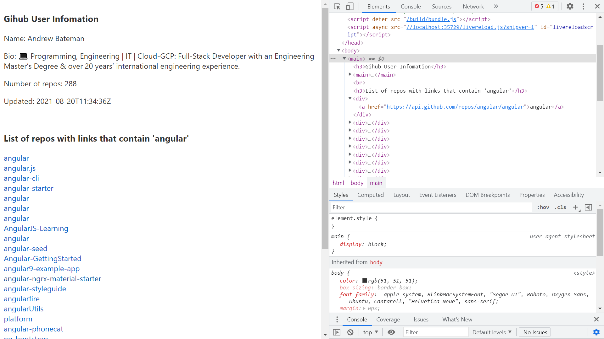

# :zap: Svelte AJAX Observables

* Sveltejs sandbox using RxJS
* /AJX to fetch API observable data.
* **Note:** to open web links in a new window use: _ctrl+click on link_

## :page_facing_up: Table of contents

* [:zap: Svelte AJAX Observables](#zap-svelte-ajax-observables)
  * [:page_facing_up: Table of contents](#page_facing_up-table-of-contents)
  * [:books: General info](#books-general-info)
  * [:camera: Screenshots](#camera-screenshots)
  * [:signal_strength: Technologies](#signal_strength-technologies)
  * [:floppy_disk: Setup](#floppy_disk-setup)
  * [:wrench: Testing](#wrench-testing)
  * [:computer: Code Examples](#computer-code-examples)
  * [:cool: Features](#cool-features)
  * [:clipboard: Status & To-Do List](#clipboard-status--to-do-list)
  * [:clap: Inspiration](#clap-inspiration)
  * [:file_folder: License](#file_folder-license)
  * [:envelope: Contact](#envelope-contact)

## :books: General info

* Displays API observable data such as Github user details
* Note: Rxjs 'startWith' used to initialise fetch with an empty array
* Note: Rxjs 'pluck operator deprecated - replaced with map()

## :camera: Screenshots

## :signal_strength: Technologies

* [Snowpack](https://www.snowpack.dev/) frontend build tool, alternative to webpack or Parcel etc.
* [Sveltejs/kit v3](https://kit.svelte.dev/) fast front-end UI library with small bundles of highly-optimized vanilla JavaScript & declarative transitions. Does not use a virtual DOM.
* [RxJS](https://rxjs.dev/) Reactive Extensions JS library
* [RxJS/AJAX](https://rxjs.dev/api/ajax/ajax) used to fetch Github API observable
* [Github REST API v2](https://docs.github.com/en/rest/reference/users) RESTful API with data on all world countries. [Get a Github access token](https://github.com/settings/tokens) so API access not limited

## :floppy_disk: Setup

* `npm i` to install dependencies
* `npm run dev` to run dev server on port `localhost:8080`. Note: I had to check `dev tools/network/Disable cache` to prevent caching and to see changes to files
* `npm run build` to build a static copy of app to a `build/` folder
* `npm run start` to run build files on port `localhost:8080`

## :wrench: Testing

* N/A

## :computer: Code Examples

* N/A

## :cool: Features

* Observables can be displayed in Svelte markup with a preceding $

## :clipboard: Status & To-Do List

* Status: Working
* To-Do: Try out more rxjs methods

## :clap: Inspiration

* [RxJS API list](https://rxjs.dev/api)

## :file_folder: License

* This project is licensed under the terms of the MIT license.

## :envelope: Contact

* Repo created by [ABateman](https://github.com/AndrewJBateman), email: gomezbateman@yahoo.com
